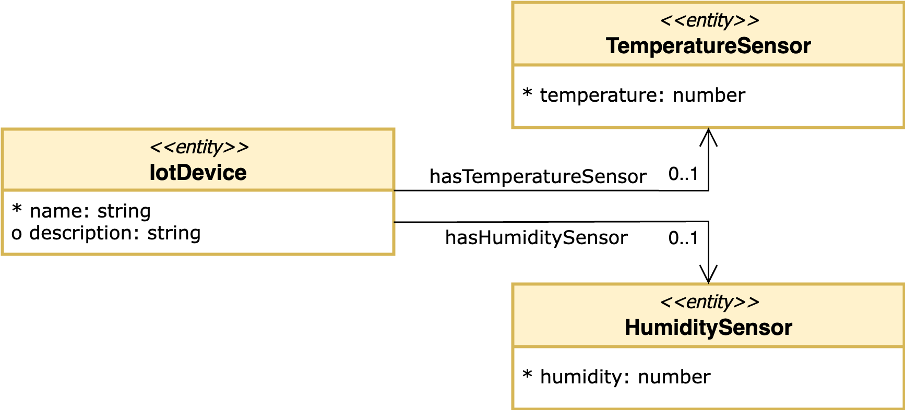
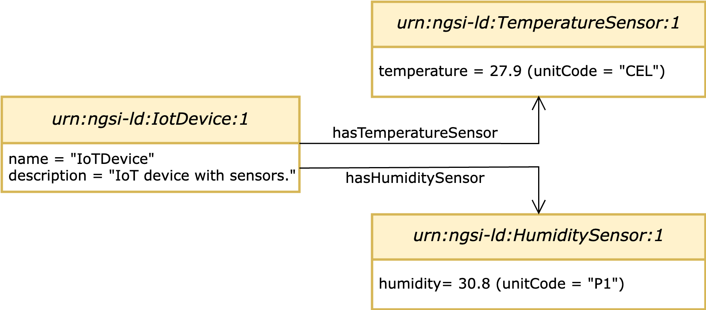

# Python-based NGSI-LD API client tester

Tester for the [`Python-based NGSI-LD API client`](https://github.com/giros-dit/python-ngsi-ld-client/tree/1.6.1) compliant with the [NGSI-LD API OpenAPI specification](https://forge.etsi.org/rep/cim/NGSI-LD/-/tree/1.6.1).

To deploy a docker-compose scenario with the [`Orion-LD`](https://github.com/FIWARE/context.Orion-LD) context broker (a reference implementation of NGSI-LD context broker compliant with the  NGSI-LD API specification by [ETSI GS CIM 009 V1.6.1](https://www.etsi.org/deliver/etsi_gs/CIM/001_099/009/01.06.01_60/gs_CIM009v010601p.pdf)), execute the following command:
```bash
$ docker-compose up
```

In case you are interested in running the scenario in background, use the following command:
```bash
$ docker-compose up -d
```

Tear the scenario down as follows:
```bash
$ docker-compose down
```

> **Note:**
>
> In the `.env` file, environment variables are defined and parameterized (i.e., the context broker endpoint and the NGSI-LD context URL).
> The [context-catalog](docker/context-catalog) container provides a static web server where JSON-LD vocabularies can be uploaded. Interactions with the NGSI-LD API can link to this webserver rather than appending the JSON-LD vocabulary in the request's body.

Within the [/ngsi-ld-models](ngsi-ld-models/) folder there is a Python library called `ngsi_ld_models` derived from the [Pydantic](https://docs.pydantic.dev/latest/) class code generation for the schemas defined in a custom OpenAPI available [here](ngsi-ld-api-schemas.yaml). This custom OpenAPI encompass the `NGSI-LD API V1.6.1` with the native NGSI-LD API metamodel schemas and customizable schemas for simple demo NGSI-LD Entities used in this NGSI-LD client tester (a sample of JSON payloads for the NGSI-LD Entities of type `IotDevice`, `TemperatureSensor`, and `HumiditySensor` are available [here](iot-sensors-tester/examples/)). The Python code of the `ngsi_ld_models` library derived from the OpenAPI specification is automatically generated by the [OpenAPI Generator](https://openapi-generator.tech) project. To generate the code derived from the particular schemas defined within the OpenAPI, the [OpenAPI Generator Docker image option](https://openapi-generator.tech/docs/installation#docker) has been used with the following command executed from the current folder:
```bash
$ docker run --rm -v ${PWD}:/ngsi-ld-client-tester openapitools/openapi-generator-cli generate -i /ngsi-ld-client-tester/ngsi-ld-api-schema.yaml -g python --package-name ngsi_ld_models -o /ngsi-ld-client-tester/ngsi-ld-models --additional-properties disallowAdditionalPropertiesIfNotPresent=false --global-property models --skip-validate-spec
```

> **Note 1:**
>
> The OpenAPI schemas for the sample NGSI-LD Entities covered in this particular NGSI-LD API client tester are defined [here](ngsi-ld-api-schemas.yaml), starting from line 5110 preceded by the comment `#Custom schemas for IoT sensors model`.

> **Note 2:**
>
> By default, the OpenAPI Generator tool grants only access for the root user to the code generated. Change the owner/group on the created directory `/ngsi-ld-models` using the following commands:
> ```bash
> $ cd ngsi-ld-models/
> $ sudo su
> $ chown -R <user>:<user> .
> $ exit
> ```

The high-level schema representation for its NGSI-LD information model is depicted below:



The `*` character represents mandatory NGSI-LD Properties of the NGSI-LD Entities. The `hasSensor` NGSI-LD Relationship of NGSI-LD Entity of type `IotDevice` is not mandatory and has cardinality `1:N` since it represents a multi-relationship to NGSI-LD Entities of type `TemperatureSensor` and/or `HumiditySentor`. All these NGSI-LD information model conventions are included in the OpenAPI schema as mentioned above.

To ease management of Python dependencies we rely on [Poetry](https://python-poetry.org/) tool. Poetry takes care of solving dependency conflicts and also configures virtual environments to develop our Python applications. Recommendations for preparing the virtual environment with `poetry` and installing the Python library `ngsi_ld_models` are described below:
1. Download and install `poetry` by following the [official documentacion](https://python-poetry.org/docs/master/#installing-with-the-official-installer).
2. Make sure you have the right Python version for this project (Python>=3.9 in this case):
    ```bash
    $ sudo apt-get install python3.9
    ```
3. Install `distutils` package for your specific Python release:
    ```bash
    $ sudo apt-get install python3-distutils
    ```
4. Install `python-is-python3` package (symlinks /usr/bin/python to Python3 as specified in [link 1](https://askubuntu.com/questions/1296790/python-is-python3-package-in-ubuntu-20-04-what-is-it-and-what-does-it-actually) and [link 2](https://stackoverflow.com/questions/61921940/running-poetry-fails-with-usr-bin-env-python-no-such-file-or-directory)):
    ```bash
    $ sudo apt-get install python-is-python3
    ```
5. To build the `ngsi_ld_models` library with the Python-generated classes for the sample NGSI-LD Entities of type `IotDevice`, `TemperatureSensor`, and `HumiditySensor`, follow these steps:
    - Move to [`/ngsi-ld-models`](ngsi-ld-models/) folder:
        ```bash
        $ cd ngsi-ld-models
        ```
    - Install the dependencies for the `ngsi_ld_models` library with `poetry`:
        ```bash
        $ poetry install
        ```
        The `ngsi_ld_models` Python library is now installed and prepared to be used.

To validate the [`create_entity`](https://github.com/giros-dit/python-ngsi-ld-client/blob/1.6.1/docs/ContextInformationProvisionApi.md#create_entity), [`retrieve_entity`](https://github.com/giros-dit/python-ngsi-ld-client/blob/1.6.1/docs/ContextInformationConsumptionApi.md#retrieve_entity), [`query_entity`](https://github.com/giros-dit/python-ngsi-ld-client/blob/1.6.1/docs/ContextInformationConsumptionApi.md#query_entity), [`update_entity`](https://github.com/giros-dit/python-ngsi-ld-client/blob/1.6.1/docs/ContextInformationProvisionApi.md#update_entity), [`delete_entity`](https://github.com/giros-dit/python-ngsi-ld-client/blob/1.6.1/docs/ContextInformationProvisionApi.md#delete_entity), and [`upsert_batch`](https://github.com/giros-dit/python-ngsi-ld-client/blob/1.6.1/docs/ContextInformationProvisionApi.md#upsert_batch) `CRUD` operations for a simple NGSI-LD Entity (e.g., NGSI-LD Entity of type `IotDevice` available [here](iot-sensors-tester/examples/iot-device/example-normalized.json)), follow these steps:
1. To play with the  NGSI-LD API `CRUD` operations for the demo NGSI-LD Entities of type `IotDevice`, `TemperatureSensor`, and `HumiditySensor`, first follow these preparation steps: 
    - Move to [`/iot-sensors-tester`](iot-sensors-tester/) folder:
        ```bash
        $ cd iot-sensors-tester
        ```
    - Enable virtual environment for your specific Python release:
        ```bash
        $ poetry env use 3.9
        ```
        > **Note:**
        >
        > If you work with [Visual Studio Code (VSC)](https://code.visualstudio.com/) IDE, it is recommendable to open the `/iot-sensors-tester` folder in an independet workspace so that the virtual environment can select the correct Python interpreter and thus recognize the source code well. In VSC you can specify the correct Python interpreter by using the [**Python: Select Interpreter** command](https://code.visualstudio.com/docs/python/environments#_working-with-python-interpreters) from the **Command Palette** (`Ctrl+Shift+P`).
    - Setup the virtual environment with Poetry:
        ```bash
        $ poetry shell
        (iot-sensors-tester-py3.9) $ poetry install
        ```
        The virtual environment is now activated and the Python dependencies (i.e., `ngsi_ld_client` and `ngsi_ld_models` Python modules) installed and ready to be used.
2. To create a sample NGSI-LD Entity (e.g, NGSI-LD Entity of type `IotDevice`) by using of the `create_entity` operation, run the [iot-sensors-tester/create-iot-device-entity.py](iot-sensors-tester/create-iot-device-entity.py) Python script as follow:
    ```bash
    (iot-sensors-tester-py3.9) $ python create-iot-device-entity.py
    ```
3. To retrieve the previously created NGSI-LD Entity by using its `id` field (i.e., `retrieve_entity` operation), run the [iot-sensors-tester/retrieve-iot-device-entity.py](iot-sensors-tester/retrieve-iot-device-entity.py) Python script as follow:
    ```bash
    (iot-sensors-tester-py3.9) $ python retrieve-iot-device-entity.py
    ```
4. To query all the NGSI-LD Entities of a particular type (e.g, NGSI-LD Entity of type `IotDevice`) by using of the `retrieve_entity` operation, run the [iot-sensors-tester/query-iot-device-entities.py](iot-sensors-tester/query-iot-device-entities.py) Python script as follow:
    ```bash
    (iot-sensors-tester-py3.9) $ python query-iot-device-entities.py
    ```
5. To update the previously created NGSI-LD Entity of type `IotDevice` by using its `id` field (i.e., `update_entity` operation), run the [iot-sensors-tester/update-iot-device-entity.py](iot-sensors-tester/update-iot-device-entity.py) Python script as follow:
    ```bash
    (iot-sensors-tester-py3.9) $ python update-iot-device-entity.py
    ```
6. To create different NGSI-LD Entities (e.g, NGSI-LD Entities of type `IotDevice`, `TemperatureSensor`, and `HumiditySensor`) by using its `id` field (i.e., `upsert_batch` operation), run the [iot-sensors-tester/upsert-iot-sensors-entities.py](iot-sensors-tester/upsert-iot-sensors-entities.py) Python script as follow:
    ```bash
    (iot-sensors-tester-py3.9) $ python upsert-iot-sensors-entities.py
    ```
    The resulting JSON payloads for the created NGSI-LD Entities of type `IotDevice`, `TemperatureSensor`, and `HumiditySensor` are available [here](iot-sensors-tester/examples/), and the regarding NGSI-LD information model representation with instantiated values is available [here](resources/images/iot-sensors-information-model-instance.png). 
    
    Also, this instance of NGSI-LD information model is depicted below:

    

7. To delete the previously created NGSI-LD Entities of type `IotDevice`, `TemperatureSensor`, and `HumiditySensor` by using its `id` field (i.e., `delete_entity` operation), run the [iot-sensors-tester/delete-iot-sensors-entities.py](iot-sensors-tester/delete-iot-sensors-entities.py) Python script as follow:
    ```bash
    (iot-sensors-tester-py3.9) $ python delete-iot-sensors-entities.py
    ```

> **Additional Notes:**
>
> There are additional Python scripts for validating other OpenAPI NGSI-LD operations such as the [`update_attrs`](https://github.com/giros-dit/python-ngsi-ld-client/blob/1.6.1/docs/ContextInformationProvisionApi.md#update_attrs), [`append_attrs`](https://github.com/giros-dit/python-ngsi-ld-client/blob/1.6.1/docs/ContextInformationProvisionApi.md#append_attrs), and [`create_subscription`](https://github.com/giros-dit/python-ngsi-ld-client/blob/1.6.1/docs/ContextInformationSubscriptionApi.md#create_subscription) but they are still under testing and development. The following instructions can be taken for now:

8. To update a particular Attribute (i.e., NGSI-LD Property or NGSI-LD Relationship) of a NGSI-LD Entity identified by its Attribute id (i.e., `update_attrs` operation), there is a sample Python script [iot-sensors-tester/update-iot-device-property-name.py](iot-sensors-tester/update-iot-device-property-name.py) that enables updating the NGSI-LD Property `name` of a particular NGSI-LD Entity of type `IotDevice` identified by its own id. Run the Python script as follow:
    ```bash
    (iot-sensors-tester-py3.9) $ python update-iot-device-property-name.py
    ```

9. To append Attributes (i.e., NGSI-LD Properties and NGSI-LD Relationships) to a particular NGSI-LD Entity (i.e., `append_attrs` operation), there is a sample Python script [iot-sensors-tester/append-attrs-iot-device-sensors.py](iot-sensors-tester/append-attrs-iot-device-sensors.py) that enables append the NGSI-LD Property `description` of a particular NGSI-LD Entity of type `IotDevice` identified by its own id. Run the Python script as follow:
    ```bash
    (iot-sensors-tester-py3.9) $ python append-iot-device-property-desc.py
    ```

10. For create subscriptions (i.e., `create_subscription` operation), there is a simple tester microservice called [`notifier-consumer`](docker/notifier-consumer/) that creates a subscription based on changes to NGSI-LD Entities of type `IotDevice` and particularly to the Attributes `name` and `hasSensor` and hope to receive notifications at a particular HTTP endpoint `http://notifier-consumer:8082/notify`. The details of the main code for the `notifier-consumer` microservice is [here](docker/notifier-consumer/notifier_consumer/main.py). Once and NGSI-LD Entity of type `IotDevice` will be created or modified, the `notifier-consumer` will receive a notification. To check the notifications received, display the associated docker container logs with the `notifier-consumer` microservice as follows: 
    ```bash
    $ docker logs -f notifier-consumer
    ```

In addition, for validating example JSON payloads (e.g., [`IotDevice`](iot-sensors-tester/examples/iot-device//example-normalized.json) example) against the autogenerated Python class bindings (e.g., `IotDevice` Pydantic class available [here](ngsi-ld-models/ngsi_ld_models/models/iot_device.py)), run the Python unit test from the `iot-sensors-tester` folder as follows:
```bash
$ cd iot-sensors-tester
$ poetry shell
(iot-sensors-tester-py3.9) $ python tests/test_iot_sensors.py
```